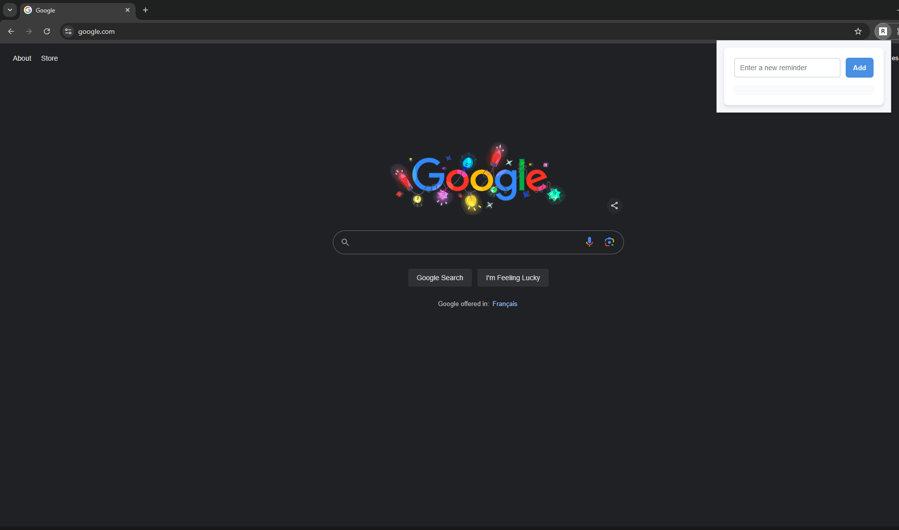
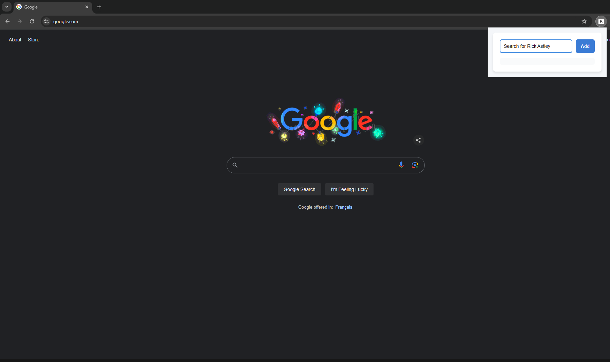
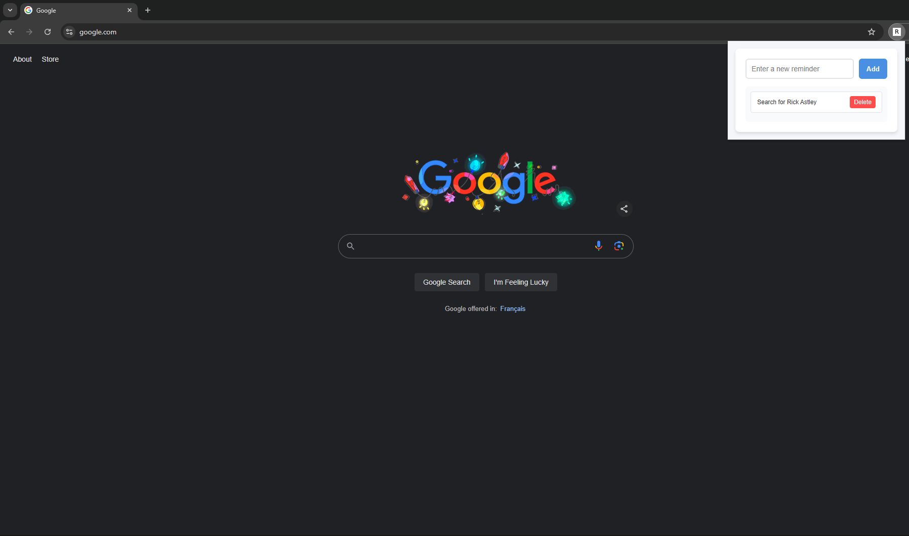
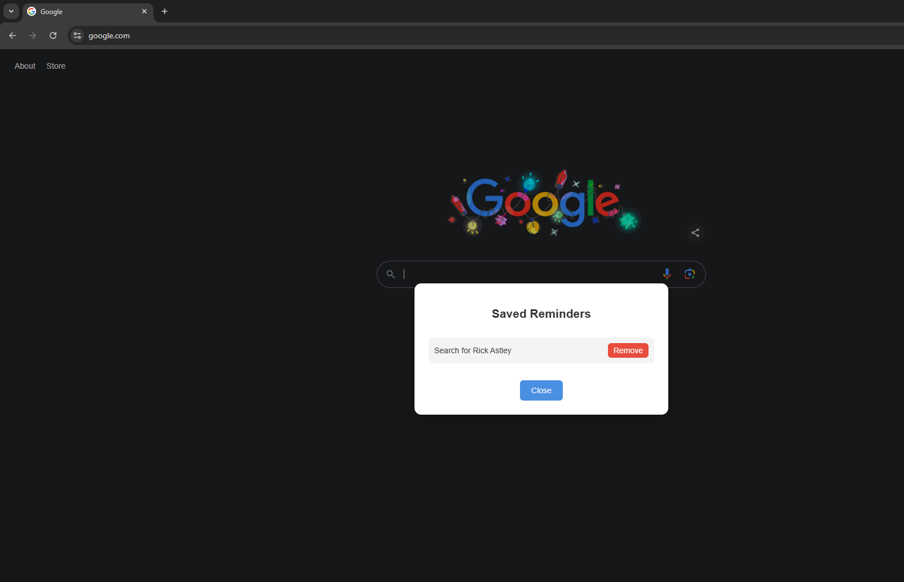

# Tab Reminders

This is a simple chrome extension to let you set reminders that you might want to search when you open a tab

Maybe you are on linkedin, looking for jobs to search and then think "Hmm, I will save these jobs and apply to them after sometime"

or maybe you watch a lot of youtube and you keep interesting videos in "watch later" and never watch.

Well this extension will remind you to do that everytime you open a new tab.

Once you reopen the tab:

Bonus: Write something to motivate you so when you open some website you shouldn't open it will popup the message